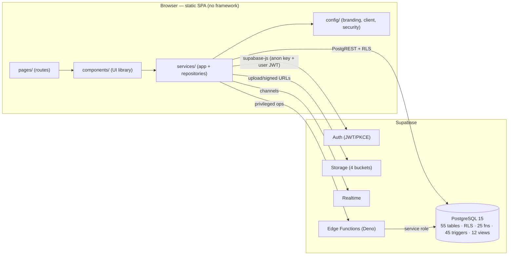
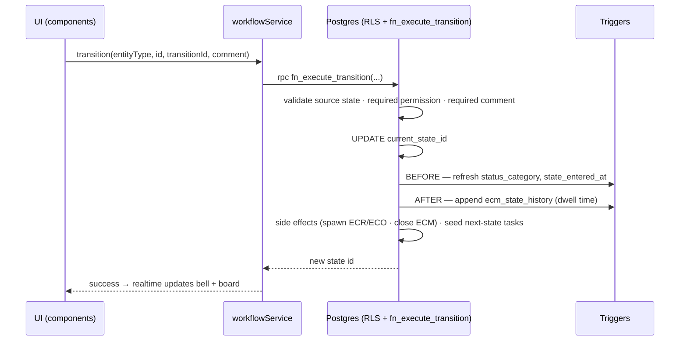
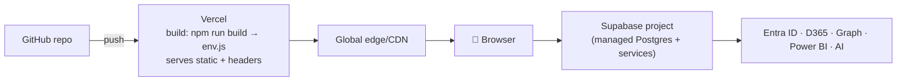

# Architecture

HydraSpecma ECM Portal is a **framework-free, component-based** web application on **Supabase**, deployed as a static site on **Vercel**. It follows **Clean Architecture**: dependencies point inward, and the business rules that must be trustworthy (workflow validation, numbering, audit, access control) live in the database — the innermost, most-protected layer.

## 1. System context (C4 L1)
```mermaid
flowchart TB
    user["👤 Users<br/>(13 roles)"]
    portal["HydraSpecma ECM Portal<br/>(static SPA on Vercel)"]
    supa["Supabase<br/>Postgres · Auth · Storage · Realtime · Edge Functions"]
    aad["Microsoft Entra ID<br/>(Azure AD SSO)"]
    graph["Microsoft 365<br/>(Graph: Outlook/Teams/SharePoint)"]
    d365["Dynamics 365 F&O<br/>(OData)"]
    pbi["Power BI<br/>(embedded)"]
    ai["AI provider<br/>(assistant)"]

    user --> portal
    portal --> supa
    portal -. SSO .-> aad
    supa -. auth .-> aad
    supa --> graph
    supa --> d365
    portal --> pbi
    supa --> ai
```

## 2. Containers (C4 L2)


## 3. Layers & folder mapping
| Layer | Folders | Responsibility |
|-------|---------|----------------|
| Presentation | `pages/`, `components/`, `css/`, `assets/` | HTML5 + Tailwind (Fluent style), vanilla ES2024, Chart.js/Lucide/GSAP/SortableJS/FullCalendar/Mermaid/PDF.js/QRCode.js. |
| Application services | `services/*/` | Use-cases: auth, workflow transitions, storage, realtime. |
| Repositories | `services/core/BaseRepository.js`, `services/**/*Repository.js` | Thin, testable data access over supabase-js. One per aggregate. |
| Domain / data | `supabase/`, `sql/`, `database/`, `workflow/` | PostgreSQL is the source of truth: constraints, RLS, functions, triggers, and the data-driven workflow engine. |
| Integration | `api/`, `supabase/functions/` | Server-side/privileged work (D365, Graph, Power BI tokens, AI, email approvals). Secrets live here only. |
| Config | `config/` | Branding, Supabase client, security posture, feature flags, env accessor. |

## 4. Request lifecycle — firing a workflow transition


## 5. Patterns
- **Repository pattern** isolates data access (`BaseRepository` + concrete repos).
- **Service layer** encapsulates use-cases and error normalization (`AppError`).
- **Component-based** UI from a small composable library.
- **Event-driven** side effects via DB triggers + Supabase Realtime.
- **Configuration over code**: workflow, notifications, templates, approvals are all data.
- **Singleton client** with PKCE auth and auto-refresh.

## 6. Security architecture
- **AuthN:** Supabase Auth (email/password) and Azure AD SSO; JWT with PKCE, auto-refresh, optional remember-me.
- **AuthZ:** **RLS on every table**, evaluated by `fn_has_permission()`, `fn_is_admin()`, `fn_can_access_plant()` against the role→permission matrix. The UI mirrors permissions for UX only; the DB is authoritative.
- **Least privilege:** browser uses the anon key + user JWT; only Edge Functions hold the service-role key. `SECURITY DEFINER` functions run privileged writes (audit, history, numbering, task seeding) with a pinned `search_path`.
- **Immutability:** field-level `audit_logs` and `ecm_state_history` are read-only to clients.
- **Transport/UI:** CSP, HSTS, X-Frame-Options, nosniff, Referrer-Policy in `vercel.json`; XSS output-escaping (`config/security.config.js`); PKCE mitigates CSRF on auth.
- **Secrets:** never in the browser or DB — `env.js` exposes public keys only; server secrets live in Vercel/Supabase env.

## 7. Deployment topology


## 8. Non-functional
- **Performance:** pagination + indexes (incl. GIN/trigram for search), denormalized `status_category` for fast dashboard filters, lazy CDN libraries, cache-immutable assets, minified CSS.
- **Scalability:** stateless static front end on CDN; Supabase scales the data tier; heavy/integration work offloaded to Edge Functions and a retryable D365 queue.
- **Observability:** `api_logs` (integration calls), `audit_logs` (data changes), `ecm_state_history` (process), notification/AI history.
- **Portability:** standard PostgreSQL 15; single-file bundles in `/sql` run outside Supabase (auth/storage pieces self-skip).
