# ECM Workflow — HydraSpecma Standard Change Flow

**Source:** `ECM Flow.xlsx` (parsed by `workflow/build_workflow.py`).
**Imported into:** the `wf_*` tables via `supabase/seed/30_workflow.sql`.
**Nothing in the flow is hardcoded** — every stage, state, transition and task lives in the database and is editable in the Admin Panel (Module 19).

- **Workflow:** `HYDRA-ECM-STD` v1 — HydraSpecma Standard Engineering Change Flow
- **Stages:** 4 &nbsp;•&nbsp; **States:** 25 &nbsp;•&nbsp; **Transitions:** 35 &nbsp;•&nbsp; **Task templates:** 32

## State machine

```mermaid
stateDiagram-v2
    direction LR
    state "Pre-request" as PRE {
        PRE_DRAFT : Draft
        PRE_SCREENING : Screening
        PRE_ACCEPTED : Accepted
        PRE_HOLD : Hold
        PRE_BACKLOG : Backlog
        PRE_REJECTED : Rejected
        PRE_CANCELLED : Cancelled
    }
    state "ECR" as ECR {
        ECR_PREP : Implementation preparation
        ECR_CRB : CR-board
        ECR_PRELIM : Preliminary accepted
        ECR_ACCEPTED : Accepted
        ECR_HOLD : Hold
        ECR_BACKLOG : Backlog
        ECR_REJECTED : Rejected
        ECR_CANCELLED : Cancelled
    }
    state "ECO" as ECO {
        ECO_TASKLIST : Task list
        ECO_REVIEW_TASKS : Review task list
        ECO_IMPL : Implementation
        ECO_IMPL_REVIEW : Implementation review
        ECO_REL_SCHED : Released for scheduling
        ECO_REL_PROD : Released for production
        ECO_FINAL_REVIEW : Final review
        ECO_REJECTED : Rejected
        ECO_CANCELLED : Cancelled
    }
    state "Closed" as CLOSED {
        RESOLVED : Resolved
    }
    [*] --> PRE_DRAFT
    PRE_DRAFT --> PRE_SCREENING : Submit pre-request for screening
    PRE_SCREENING --> PRE_ACCEPTED : Accept pre-request
    PRE_SCREENING --> PRE_DRAFT : Return pre-request
    PRE_SCREENING --> PRE_HOLD : Hold pre-request
    PRE_SCREENING --> PRE_BACKLOG : Move to backlog
    PRE_SCREENING --> PRE_REJECTED : Reject pre-request
    PRE_SCREENING --> PRE_CANCELLED : Cancel pre-request
    PRE_HOLD --> PRE_SCREENING : Resume screening
    PRE_BACKLOG --> PRE_SCREENING : Reactivate from backlog
    PRE_ACCEPTED --> ECR_PREP : Create ECR & share number
    ECR_PREP --> ECR_CRB : Submit solution to CR-board
    ECR_CRB --> ECR_PRELIM : Preliminary accept (CRB)
    ECR_CRB --> ECR_PREP : Return solution
    ECR_CRB --> ECR_HOLD : Hold solution
    ECR_CRB --> ECR_BACKLOG : Move to backlog
    ECR_CRB --> ECR_REJECTED : Reject solution
    ECR_CRB --> ECR_CANCELLED : Cancel ECR
    ECR_HOLD --> ECR_CRB : Resume at CR-board
    ECR_BACKLOG --> ECR_CRB : Reactivate from backlog
    ECR_PRELIM --> ECR_ACCEPTED : Customer accepts ECR
    ECR_PRELIM --> ECR_REJECTED : Customer rejects ECR
    ECR_PRELIM --> ECR_CANCELLED : Cancel ECR
    ECR_ACCEPTED --> ECO_TASKLIST : Create ECO & inform stakeholders
    ECO_TASKLIST --> ECO_REVIEW_TASKS : Submit task list for review
    ECO_REVIEW_TASKS --> ECO_IMPL : Accept task list
    ECO_REVIEW_TASKS --> ECO_TASKLIST : Rework task list
    ECO_IMPL --> ECO_IMPL_REVIEW : Submit implementation for review
    ECO_IMPL_REVIEW --> ECO_REL_SCHED : Accept implementation
    ECO_IMPL_REVIEW --> ECO_IMPL : Rework implementation
    ECO_REL_SCHED --> ECO_REL_PROD : Release for production
    ECO_REL_SCHED --> ECO_REJECTED : Reject (customer)
    ECO_REL_SCHED --> ECO_CANCELLED : Cancel ECO
    ECO_REL_PROD --> ECO_FINAL_REVIEW : Submit for final review
    ECO_FINAL_REVIEW --> RESOLVED : Resolve & close
    ECO_FINAL_REVIEW --> ECO_REL_PROD : Rework (production)
    RESOLVED --> [*]
```

## Stages

| Code | Name | Governs | Sequence |
|------|------|---------|----------|
| `PRE` | Pre-request | ECM | 10 |
| `ECR` | ECR | ECR | 20 |
| `ECO` | ECO | ECO | 30 |
| `CLOSED` | Closed | ECM | 40 |

## States

| Stage | Code | Name | Category | Initial | Terminal | SLA (h) |
|-------|------|------|----------|:------:|:-------:|:------:|
| PRE | `PRE_DRAFT` | Draft | draft | ✓ |  | 72 |
| PRE | `PRE_SCREENING` | Screening | screening |  |  | 48 |
| PRE | `PRE_ACCEPTED` | Accepted | accepted |  |  |  |
| PRE | `PRE_HOLD` | Hold | hold |  |  |  |
| PRE | `PRE_BACKLOG` | Backlog | backlog |  |  |  |
| PRE | `PRE_REJECTED` | Rejected | rejected |  | ✓ |  |
| PRE | `PRE_CANCELLED` | Cancelled | cancelled |  | ✓ |  |
| ECR | `ECR_PREP` | Implementation preparation | in_progress | ✓ |  | 120 |
| ECR | `ECR_CRB` | CR-board | approval |  |  | 72 |
| ECR | `ECR_PRELIM` | Preliminary accepted | in_progress |  |  | 120 |
| ECR | `ECR_ACCEPTED` | Accepted | accepted |  |  |  |
| ECR | `ECR_HOLD` | Hold | hold |  |  |  |
| ECR | `ECR_BACKLOG` | Backlog | backlog |  |  |  |
| ECR | `ECR_REJECTED` | Rejected | rejected |  | ✓ |  |
| ECR | `ECR_CANCELLED` | Cancelled | cancelled |  | ✓ |  |
| ECO | `ECO_TASKLIST` | Task list | in_progress | ✓ |  | 72 |
| ECO | `ECO_REVIEW_TASKS` | Review task list | review |  |  | 48 |
| ECO | `ECO_IMPL` | Implementation | in_progress |  |  | 240 |
| ECO | `ECO_IMPL_REVIEW` | Implementation review | review |  |  | 48 |
| ECO | `ECO_REL_SCHED` | Released for scheduling | in_progress |  |  | 72 |
| ECO | `ECO_REL_PROD` | Released for production | in_progress |  |  | 240 |
| ECO | `ECO_FINAL_REVIEW` | Final review | review |  |  | 48 |
| ECO | `ECO_REJECTED` | Rejected | rejected |  | ✓ |  |
| ECO | `ECO_CANCELLED` | Cancelled | cancelled |  | ✓ |  |
| CLOSED | `RESOLVED` | Resolved | resolved |  | ✓ |  |

## Transitions

| From | Action | To | Permission | Comment | Approval | Side effect |
|------|--------|----|-----------|:------:|:-------:|-------------|
| PRE_DRAFT | Submit pre-request for screening | PRE_SCREENING | `ecm.submit` |  |  |  |
| PRE_SCREENING | Accept pre-request | PRE_ACCEPTED | `ecm.screen` | ✓ |  |  |
| PRE_SCREENING | Return pre-request | PRE_DRAFT | `ecm.screen` | ✓ |  |  |
| PRE_SCREENING | Hold pre-request | PRE_HOLD | `ecm.screen` | ✓ |  |  |
| PRE_SCREENING | Move to backlog | PRE_BACKLOG | `ecm.screen` |  |  |  |
| PRE_SCREENING | Reject pre-request | PRE_REJECTED | `ecm.screen` | ✓ |  |  |
| PRE_SCREENING | Cancel pre-request | PRE_CANCELLED | `ecm.screen` | ✓ |  |  |
| PRE_HOLD | Resume screening | PRE_SCREENING | `ecm.screen` |  |  |  |
| PRE_BACKLOG | Reactivate from backlog | PRE_SCREENING | `ecm.screen` |  |  |  |
| PRE_ACCEPTED | Create ECR & share number | ECR_PREP | `ecr.create` |  |  | create_ecr |
| ECR_PREP | Submit solution to CR-board | ECR_CRB | `ecr.submit` |  |  |  |
| ECR_CRB | Preliminary accept (CRB) | ECR_PRELIM | `ecr.crb_decide` | ✓ | ✓ |  |
| ECR_CRB | Return solution | ECR_PREP | `ecr.crb_decide` | ✓ |  |  |
| ECR_CRB | Hold solution | ECR_HOLD | `ecr.crb_decide` | ✓ |  |  |
| ECR_CRB | Move to backlog | ECR_BACKLOG | `ecr.crb_decide` |  |  |  |
| ECR_CRB | Reject solution | ECR_REJECTED | `ecr.crb_decide` | ✓ | ✓ |  |
| ECR_CRB | Cancel ECR | ECR_CANCELLED | `ecr.crb_decide` | ✓ |  |  |
| ECR_HOLD | Resume at CR-board | ECR_CRB | `ecr.crb_decide` |  |  |  |
| ECR_BACKLOG | Reactivate from backlog | ECR_CRB | `ecr.crb_decide` |  |  |  |
| ECR_PRELIM | Customer accepts ECR | ECR_ACCEPTED | `ecr.customer_decide` | ✓ |  |  |
| ECR_PRELIM | Customer rejects ECR | ECR_REJECTED | `ecr.customer_decide` | ✓ |  |  |
| ECR_PRELIM | Cancel ECR | ECR_CANCELLED | `ecr.customer_decide` | ✓ |  |  |
| ECR_ACCEPTED | Create ECO & inform stakeholders | ECO_TASKLIST | `eco.create` |  |  | create_eco |
| ECO_TASKLIST | Submit task list for review | ECO_REVIEW_TASKS | `eco.manage` |  |  |  |
| ECO_REVIEW_TASKS | Accept task list | ECO_IMPL | `eco.review` | ✓ |  |  |
| ECO_REVIEW_TASKS | Rework task list | ECO_TASKLIST | `eco.review` | ✓ |  |  |
| ECO_IMPL | Submit implementation for review | ECO_IMPL_REVIEW | `eco.manage` |  |  |  |
| ECO_IMPL_REVIEW | Accept implementation | ECO_REL_SCHED | `eco.review` | ✓ | ✓ |  |
| ECO_IMPL_REVIEW | Rework implementation | ECO_IMPL | `eco.review` | ✓ |  |  |
| ECO_REL_SCHED | Release for production | ECO_REL_PROD | `eco.release` | ✓ | ✓ |  |
| ECO_REL_SCHED | Reject (customer) | ECO_REJECTED | `eco.review` | ✓ |  |  |
| ECO_REL_SCHED | Cancel ECO | ECO_CANCELLED | `eco.review` | ✓ |  |  |
| ECO_REL_PROD | Submit for final review | ECO_FINAL_REVIEW | `eco.manage` |  |  |  |
| ECO_FINAL_REVIEW | Resolve & close | RESOLVED | `eco.close` | ✓ | ✓ | close_ecm |
| ECO_FINAL_REVIEW | Rework (production) | ECO_REL_PROD | `eco.review` | ✓ |  |  |

## Task templates (checklist per state)

Instantiated automatically into `ecm_tasks` on state entry (`fn_instantiate_state_tasks`).

| State | Seq | Task | Type | Mandatory | Default role |
|-------|----:|------|------|:--------:|--------------|
| ECO_FINAL_REVIEW | 10 | Review / evaluate implementation | review | ✓ | ENG_MANAGER |
| ECO_IMPL | 10 | Execute implementation plan | task | ✓ | ENGINEER |
| ECO_IMPL | 20 | Create new item number | task | ✓ | ENGINEER |
| ECO_IMPL | 30 | Create / update BOM | task | ✓ | ENGINEER |
| ECO_IMPL | 40 | Create / update documents | task | ✓ | ENGINEER |
| ECO_IMPL | 50 | Release BOM to site | task | ✓ | PLANNING |
| ECO_IMPL | 60 | Prepare components for purchase | task | ✓ | PURCHASING |
| ECO_IMPL | 70 | Define PPAP | task | ✓ | QUALITY |
| ECO_IMPL_REVIEW | 10 | Review implementation (accept / rework) | review | ✓ | ENG_MANAGER |
| ECO_REL_PROD | 10 | Update ECO | task | ✓ | ECM_ADMIN |
| ECO_REL_PROD | 20 | Update component data | task | ✓ | ENGINEER |
| ECO_REL_PROD | 30 | Follow up on PPAP | task | ✓ | QUALITY |
| ECO_REL_PROD | 40 | Inform customer | task |  | ENG_MANAGER |
| ECO_REL_PROD | 50 | Plan orders | task | ✓ | PLANNING |
| ECO_REL_PROD | 60 | Update production documents (projects & serial) | task | ✓ | PRODUCTION |
| ECO_REL_PROD | 70 | Clear up stock | task | ✓ | WAREHOUSE |
| ECO_REL_PROD | 80 | Follow up on quality | task | ✓ | QUALITY |
| ECO_REL_SCHED | 10 | Local schedule | task | ✓ | PLANNING |
| ECO_REL_SCHED | 20 | Agreement with customer | task |  | ENG_MANAGER |
| ECO_REVIEW_TASKS | 10 | Review / evaluate implementation task list | review | ✓ | ENG_MANAGER |
| ECO_TASKLIST | 10 | Create ECO & inform stakeholders | task | ✓ | ECM_ADMIN |
| ECO_TASKLIST | 20 | Create implementation task list | task | ✓ | ENGINEER |
| ECR_CRB | 10 | CRB meeting | meeting | ✓ | CR_BOARD |
| ECR_CRB | 20 | Decide on go-ahead | decision | ✓ | CR_BOARD |
| ECR_PRELIM | 10 | Discussion with customer | task | ✓ | ENG_MANAGER |
| ECR_PRELIM | 20 | Customer decision | decision | ✓ | ENG_MANAGER |
| ECR_PREP | 10 | ECR created and ECR number shared with requestor | task | ✓ | ECM_ADMIN |
| ECR_PREP | 20 | Analyse impact & prepare solution | task | ✓ | ENGINEER |
| ECR_PREP | 30 | Review solution | review | ✓ | ENG_MANAGER |
| PRE_DRAFT | 10 | Fill in information in the pre-request | task | ✓ | ENGINEER |
| PRE_DRAFT | 20 | Submit pre-request for screening | task | ✓ | ENGINEER |
| PRE_SCREENING | 30 | Decide on go-ahead (accept / reject / return / hold) | decision | ✓ | ENG_MANAGER |

## How a change flows

1. **Pre-request** — an engineer drafts a pre-request (`PRE_DRAFT`) and submits it for **Screening**. The screening decision (`ecm.screen`) accepts, rejects, returns, holds or backlogs it.
2. **ECR** — on acceptance, `link_to_ecr` fires `create_ecr` (a numbered ECR record is spawned) and the change enters **Implementation preparation**. Impact is analysed, a solution prepared and reviewed, then taken to the **CR-board**. A preliminary decision leads to customer discussion and a final accept/reject.
3. **ECO** — on ECR acceptance, `link_to_eco` fires `create_eco`. The ECO builds a task list, executes implementation (items, BOM, documents, purchasing, PPAP), passes implementation review, is released for scheduling then production, and finishes with a **Final review**.
4. **Resolved** — `resolve` fires `close_ecm`, stamping `closed_at`. Rejected / Cancelled are terminal at every stage.

Every transition is validated by `fn_execute_transition()` which enforces the source state, the required permission, and the mandatory-comment rule, then records an entry in `ecm_state_history` (with dwell time) and instantiates the next state's tasks.
